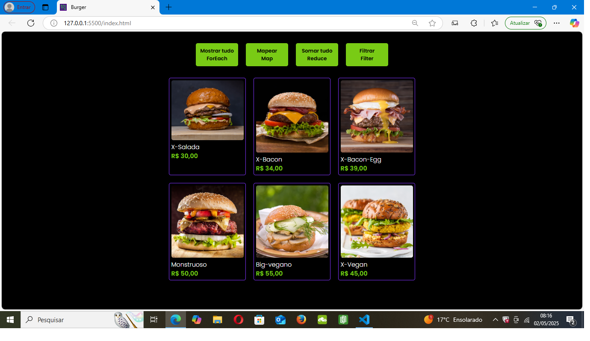
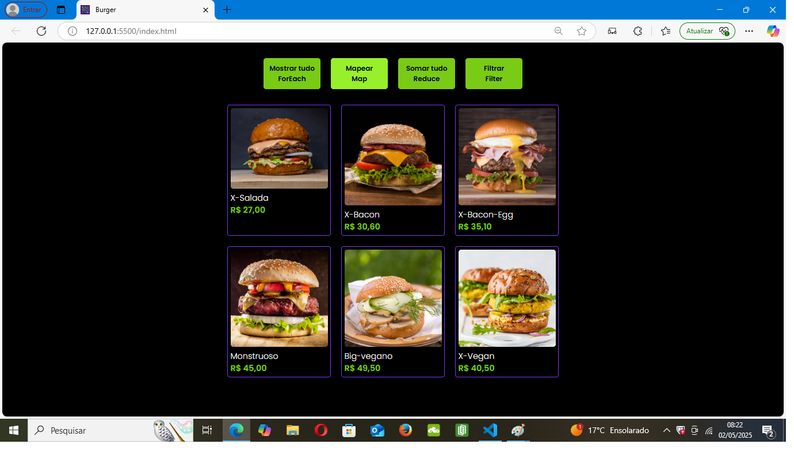
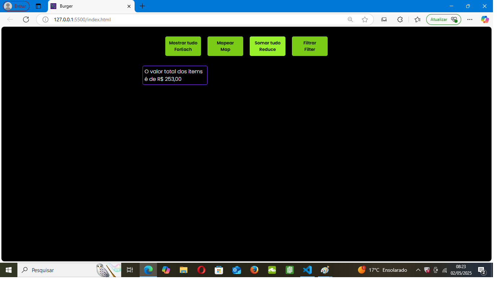
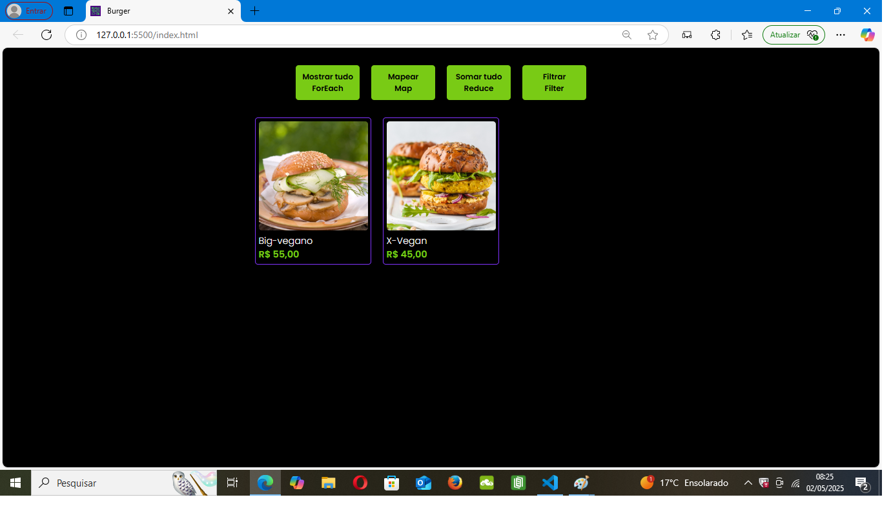

  <h1>BURGUER</h1>
  <h2>Trabalhando com array </h2>

Esse projeto é para mostrar alguns métodos que podem ser trabalhados no array com javaScript. 

Segue informações de cada método para que serve e como foi utilizado no projeto.

<h2>FOREACH</h2>

Serve para iterar cada elemento do array começando do primerio e indo até o último item do array. 

Nesse caso mostrou todas as opções de hamburguer que tinha no array.

<h2>MAP</h2>

Cria um novo array com a mesma quantidade de itens do array original , alterando alguma informação ou 
acrescentado um novo campo , mais a quantidade de itens do array continua a mesma.

Nesse caso foi feito um desconto de 10% nos valores de todos os produtos.

<h2>REDUCE</h2>

Reduz o array a apenas um item.

Nesse caso foi feita a soma do preço dos hamburgueres e exibido na tela o valor.

<h2>FILTER</h2>

Serve para filtar itens de um array.

Nesse caso filtrou e mostrou apenas os produtos veganos.

